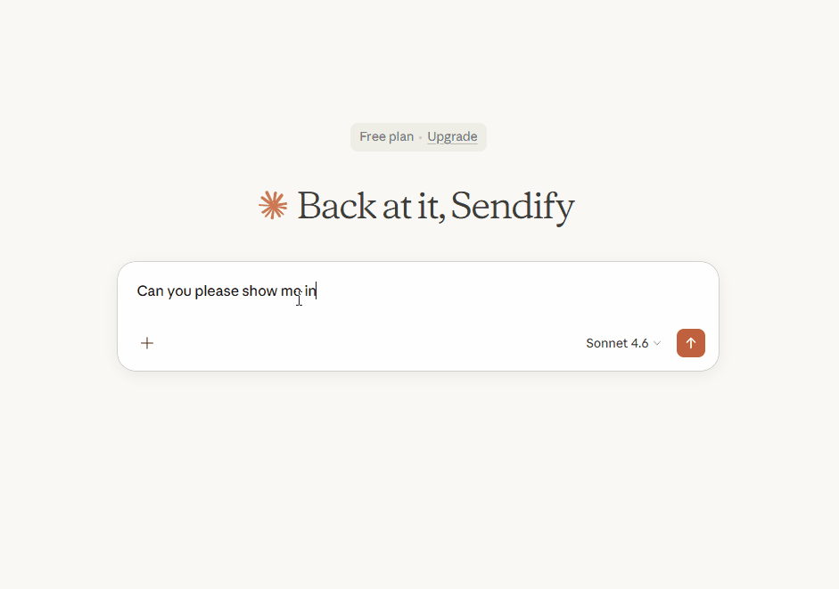

# DB Schenker Shipment Information MCP Server

The above shows Claude Desktop making use of my MCP tool, retrieving and structuring data from [this website](https://www.dbschenker.com/app/tracking-public/?refNumber=VAN5022058&language_region=en-US_US&uiMode=)  

## How to test it yourself (with Claude Desktop)
##### 1. [Install uv for your OS](https://docs.astral.sh/uv/getting-started/installation/)
##### 2. Set up Claude Desktop 
   - [Download Claude Desktop for your OS](https://claude.com/download) (if you don't already have it)
   - Follow the installation instructions and open the app.
   - Log in or create an account and proceed to the chat view.
   - Now in the app, click the hamburger menu in the top left.
   - Navigate to File -> Settings -> Developer.
   - Click 'Edit Config'.
     

     
<it>If you see a file not found error...<it>

     <ul><li>Open your file explorer and head to the parent location of the directory shown in the error (remove "/Claude").</li>
        <li>Create a folder called 'Claude' and continue from the next step.</li></ul>
     

   - [Download the config file](./resources/claude_desktop_config.json) and place it in the Claude folder, or add its contents to the config file if it already exists in the folder.
##### 3. Verify setup
   - Close Claude Desktop if it was running (you might need to end the in a task manager)
   - Open Claude Desktop
   - Click the + sign to the left of the text field
   - Hover over connectors
   - You should now see "DBSchenker" listed as a connector.

#### You are now ready to test the server! Try asking Claude about the following reference IDs:
- 1806203236 - Valid, one package
- 1806290829 - Valid, two packages
- 180620323  - Invalid, should not find.
- 123        - Invalid, should ask you for correct format.
## My journey and approach

### Understanding MCP:
I had never heard of MCP prior to this, so I started by visiting their documentation. A skill I've developed during my studies is how to use LLMs to improve my learning (as opposed to impede - the trap which many students fall in), so I also made lots of prompts asking for pedagogical explanations. Whenever something didn't quite feel intuitive or right, it was of course important to fact check the robot. Since I've studied network protocols, understanding MCP was rather intuitive.

### Learning Web Scraping:
Automating website interaction is something I've had in mind for some projects that only ever stayed in my head, but with this I had no choice but to learn it. At first, I thought I would be parsing HTML using a simple request library but, of course, someone has always had the same problem as you have and there exists a good library for most things. My approach to selecting a library to use was to describe the use case to an LLM and then ask it for suggestions with provided rationale. I got recommended Playwright, a library for automating web tests, and after looking into their documentation I decided to stick with it. In essence, it launches a headless browser and provides an intuitive API for you as a programmer to navigate it.

### Usability vs Reliability:
Through building this MCP server, I continuously tweaked the timeout values up and down with two opposite arguments in my head:
- The timeout should be short so that a faulty input is swiftly detected
- The timeout should be long so that an end user with poor internet connection does not get timed out for a valid request.

In the end, I decided to go with short timeouts and prioritize usability. Since I have no empirical evidence to base it on, the decision was based on my own experience. I would rather have it work faster the 99/100 times I am using it (with fast network connection) and not at all 1/100 times (with slow network), rather than it working 100/100 times but responding slowly to every input error I make.
